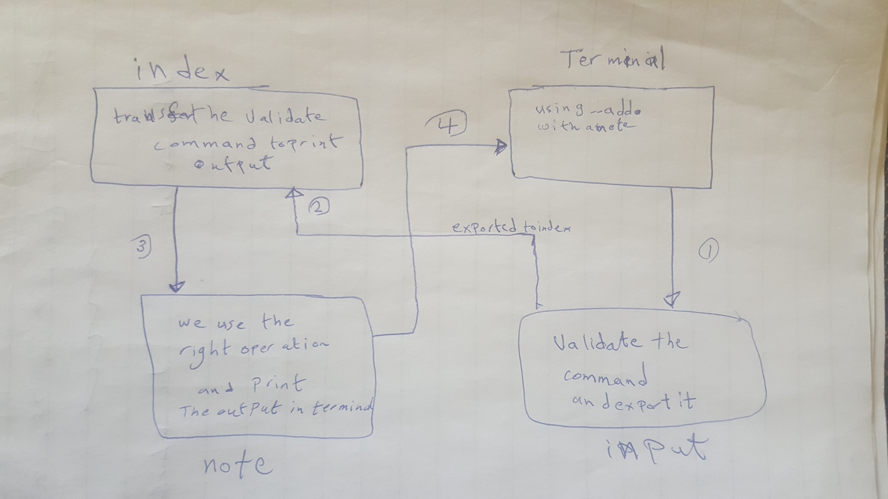

# LAB - Class 02

## Project: notes

### Author: Amer Majdi

### Links and Resources

- [submission PR](https://github.com/Amer-401-advanced-javascript/notes/pull/1)

### Setup

#### `.env` requirements (where applicable)

#### How to initialize/run your application (where applicable)

- e.g. `node index.js`

#### How to use your library (where applicable)

#### Tests

#### UML

