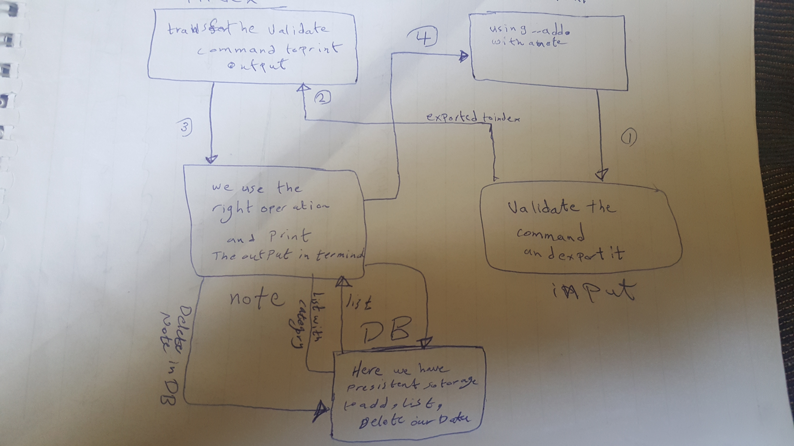

# LAB - Class 04

## Project: Notsy

### Author: Amer Majdi

### Links and Resources

- [submission PR](https://github.com/Amer-401-advanced-javascript/notes/pull/3)
- [GH]()

### Setup

#### `.env` requirements (where applicable)

#### How to initialize/run your application (where applicable)

- e.g. `node index.js`
npm start

#### How to use your library (where applicable)

#### Tests

- Unit Tests: `npm run test`
- Lint Tests: `npm run lint`

#### UML

